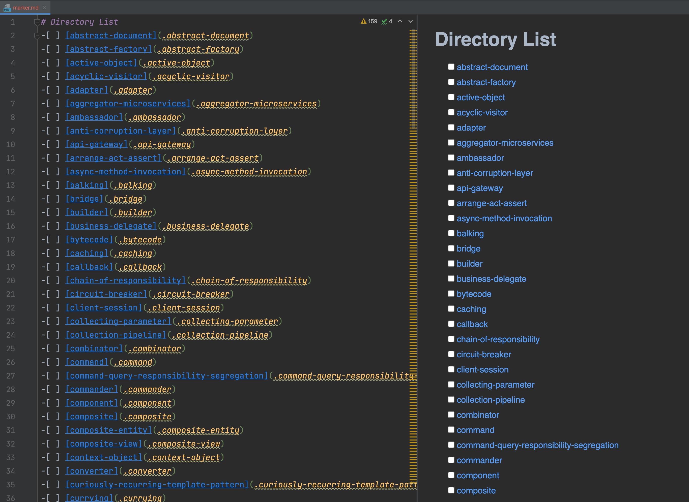
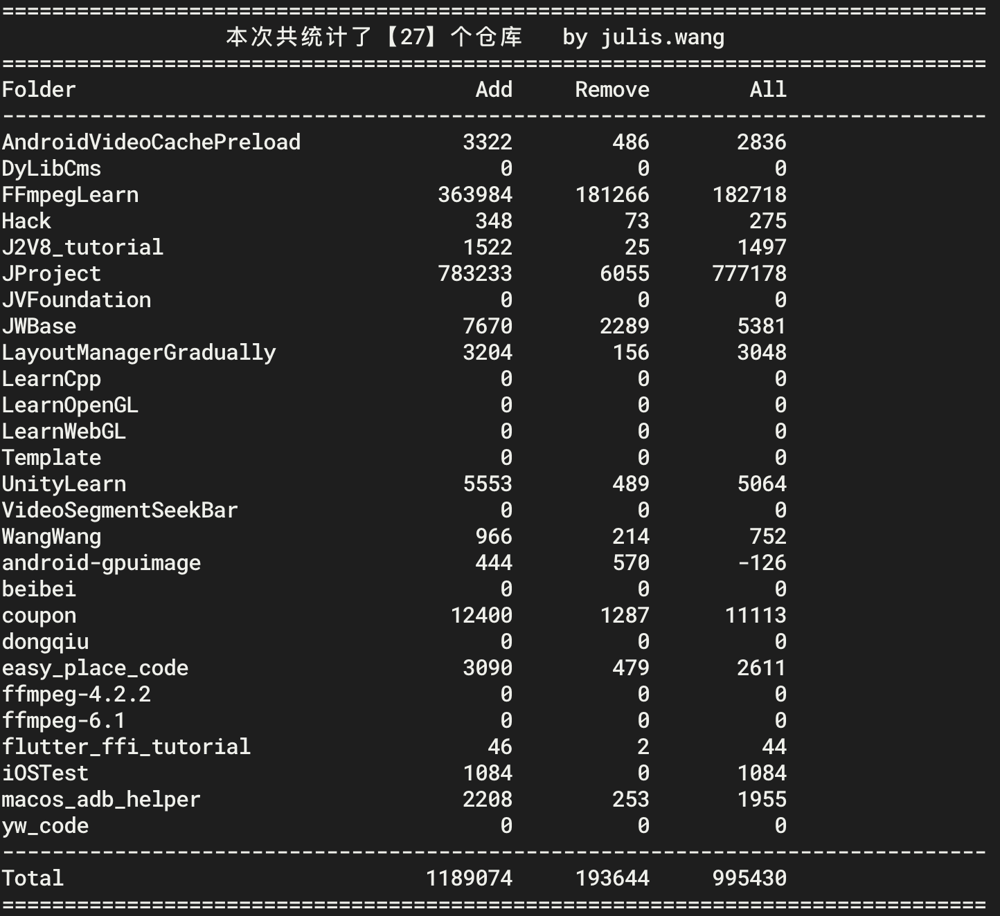

# Hack

## 一些方便的脚本

所有代码环境基于 Mac，Windows 可以参照相关逻辑自行操作。

##  [Apk 一件解包](apk_reverse/apk2dex2jar2class2java.sh)

解压apk 文件夹，提取 apk 里面的 .dex、.jar、.class、.java 文件，方便逆向相关代码查看

运行 `sh apk2dex2jar2class2java.sh /xx/xx.apk`

## [获取视频帧序列](videoFrames.sh)
需要有 ffmpeg 环境，使用 `sh videoFrames.sh target.mp4 frames.xml`

## [MacOS 双开微信](wechat.sh)
sh wechat.sh 即可

## [目录标记](dir_mark.sh)
适合学习过程中使用，用于标记哪些是自己看过的，并且能快速跳转过去

demo:



## [快捷命令](my_alias.md)
在命令行的环境变量里添加相关的 alias 即可
i.g
```shell
alias gc="git clone"
alias c="clear"
alias sl="pmset sleepnow"  ## 电脑进行睡眠
alias de="cd /Users/juliswang/Desktop" ## 快速到我的桌面
```


## [代码统计](codeLine.sh)

详细操作方式[《想统计自己总共提交了多少行代码？》](https://julis.wang/2020/03/02/%E6%83%B3%E7%BB%9F%E8%AE%A1%E8%87%AA%E5%B7%B1%E6%80%BB%E5%85%B1%E6%8F%90%E4%BA%A4%E4%BA%86%E5%A4%9A%E5%B0%91%E8%A1%8C%E4%BB%A3%E7%A0%81%EF%BC%9F/)

0、将该脚本移动到目标文件夹下

1、将脚本里 `users_name` 换成自己的的用户名

2、由于文件夹下可能有一些例外的不需要统计，可以添加忽略的文件夹

3、最后使用 `sh codeLine.sh` 执行命令

demo:




